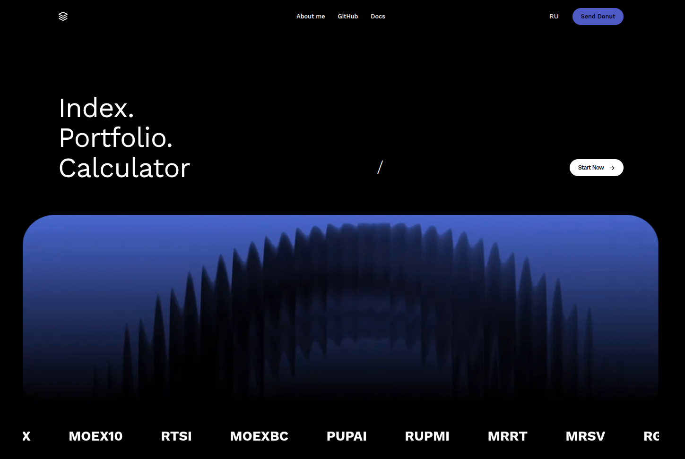
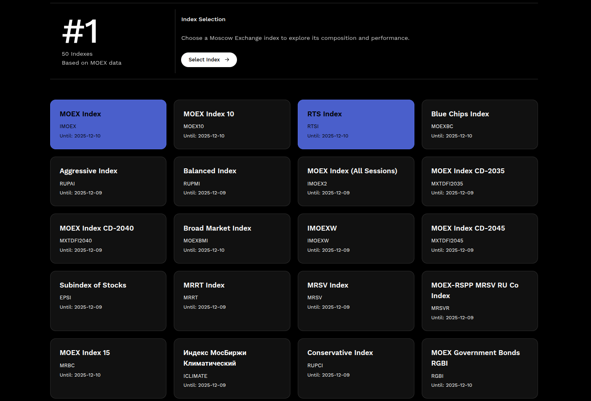
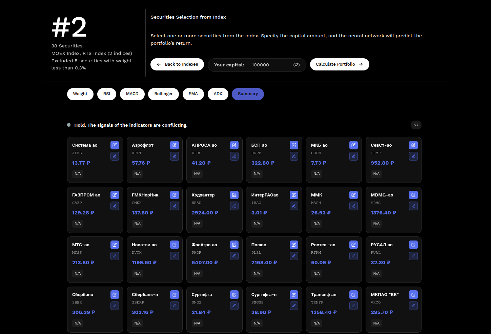
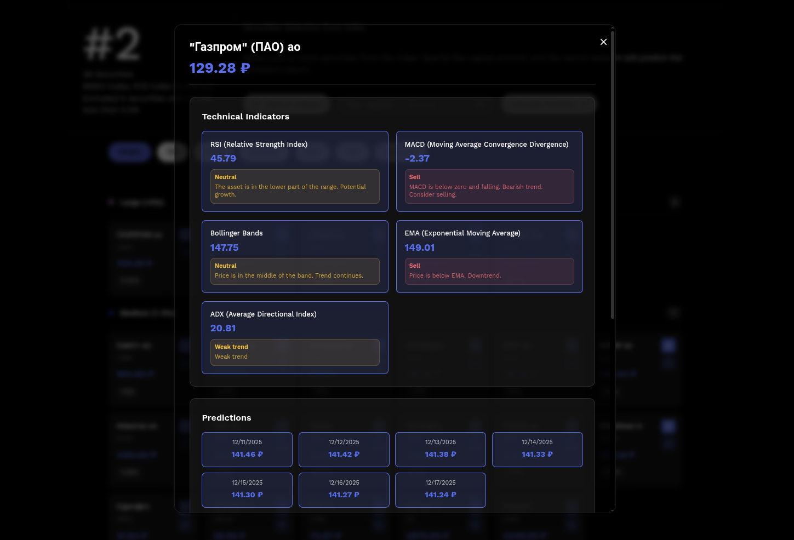
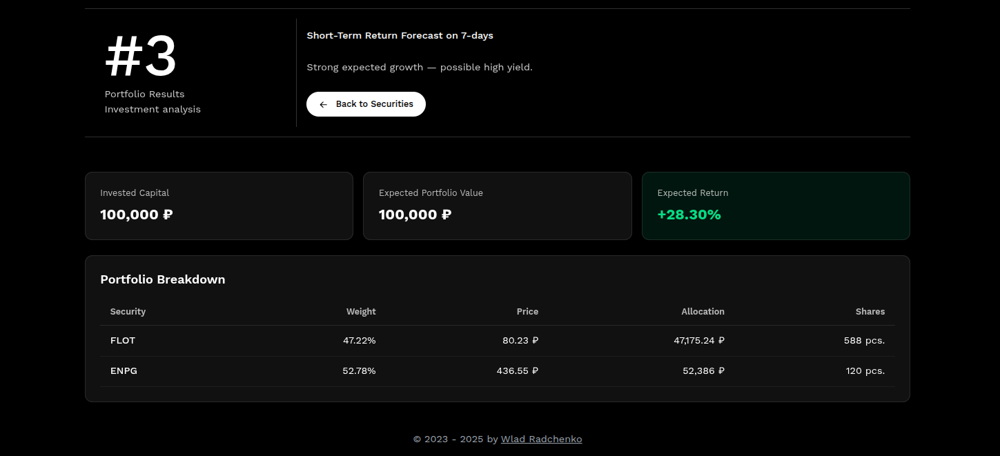

[](https://github.com/wladradchenko/invest.wladradchenko.ru/blob/main/LICENSE)
[](https://badge.fury.io/py/aiohttp)
[](https://github.com/wladradchenko/invest.wladradchenko.ru)
[](https://github.com/wladradchenko/invest.wladradchenko.ru/blob/main/LICENSE)

<p align="right">[<a href="README_ru.md">RU v2.0</a>]</p>
<div id="top"></div>

<br />
<div align="center">
  <a href="https://github.com/wladradchenko/invest.wladradchenko.ru">
    
  </a>

  <h3 align="center">MOEX Portfolio Calculator</h3>

  <p align="center">
    Documentation
    <br/>
    <a href="https://github.com/wladradchenko/invest.wladradchenko.ru/issues">Issue</a>
    ·
    <a href="https://github.com/wladradchenko/invest.wladradchenko.ru/issues">Discussions</a>
  </p>
</div>

A modern web application for analyzing Moscow Exchange (MOEX) stocks using neural networks and technical indicators.

## Features

* **Technical Indicators with Detailed Explanations and Recommendations**

  * RSI (Relative Strength Index)
  * MACD (Moving Average Convergence Divergence)
  * Bollinger Bands
  * EMA (Exponential Moving Average)
  * ADX (Average Directional Index)
  * Summary (General recommendation)
 
* **Neural networks for analyzing market sentiment for securities** (branch [LLM](https://github.com/wladradchenko/invest.wladradchenko.ru/tree/llm))
  * LLM model (2 GB VRAM or 12 GB versions) for analyzing text, images, videos, and filtering comments
  * Text-based sentiment analyzer
  * Text-based emotion analyzer
  * Parsing comments for a 7-day period for a security
  * Calculating sentiment indicators

* **Neural Networks for Price Forecasting**

  * LSTM models for time series analysis
  * 7-day price forecasts
  * Confidence estimation for predictions

* **Smart Recommendations**

  * Automatic analysis of all indicators
  * Mix indicators and securites
  * Buy/sell/hold recommendations
  * Explanation of each indicator

* **User Interface**

  * New design
  * Light color scheme
  * Responsive layout

* **SQLite Database**

  * Lightweight local database
  * Data caching
  * Fast access to historical data

## Installation

1. Ensure Python 3.9+ is installed.
2. Create a virtual environment (if not already created):

```
python -m venv venv
source venv/bin/activate  # Linux/Mac
# or
venv\Scripts\activate  # Windows
```

3. Install dependencies:

```
pip install -r requirements.txt
```

**Note**: TA-Lib may require system libraries:

* Ubuntu/Debian: `sudo apt-get install ta-lib`
* macOS: `brew install ta-lib`
* Windows: download the library from [official site](https://ta-lib.org/install/)

The application will still work with simplified indicators if TA-Lib is unavailable.

## Dependencies

* `aiohttp` — asynchronous web framework
* `aiosqlite` — asynchronous SQLite client
* `numpy`, `pandas` — data manipulation
* `scikit-learn` — machine learning
* `torch` — PyTorch for neural networks
* `TA-Lib` — technical indicators (optional)

## Running the Application

```
python app.py
```

The application will be available at: [http://localhost:8080](http://localhost:8080)

## Usage

1. Open the application in a web browser.
2. Select one or more indexes.
3. Select securities, adjust the weight if necessary and click on portfolio calculation.
4. Review the analysis results:

   * Technical indicators with explanations
   * Buy/sell recommendations
   * Neural network forecasts
   * Overall stock evaluation

Additionally:

   * Technical indicators, predicted price changes, coupons, dividends in a detailed description of the security
   * Grouping securities by technical indicators and general conclusion.
   * Mixing various indicators and smart exclusion of underweight securities and recalculation of weighting taking into account diversification
   * English and Russian localization

## Architecture

The project consists of the following modules:

* `app.py` — main application and web server
* `database.py` — SQLite database management
* `moex_api.py` — MOEX API client
* `ml_models.py` — machine learning models (LSTM)
* `indicators.py` — technical indicator calculations
* `static/` — static files (HTML, CSS, JS)

## API Endpoints

* `GET /` — main page
* `GET /api/security/{secid}` — stock data
* `GET /api/search?q={query}` — search for stocks
* `GET /api/indexes` — list of indexes
* `GET /api/index/{indexid}/securities` — stocks in an index

## Example Indexes

* MOEX10 — MOEX Index
* MOEXBC — Blue Chips Index
* MOEXBMI — Broad Market Index
* RGBI — MOEX Government Bonds RGBI
* RUABITR — ABI TR

## Important Notes

1. Forecasts are **not financial advice**; use them for analysis purposes only.
2. Neural networks require sufficient historical data (minimum 60 candles) for quality predictions.
3. MOEX API has rate limits; avoid excessive requests.
4. TA-Lib is optional; the application works with simplified indicators if unavailable.

## Differences from Previous Version

* Removed Tinkoff API dependency
* Uses only MOEX API
* Switched to SQLite from MySQL
* Added neural networks for predictions
* Improved style UI design
* Detailed explanations of technical indicators
* Smart recommendation system

## License

This project is a personal pet project for learning and analysis purposes.

## Contributing

The project is open for improvements and suggestions.

<!-- Screens -->
## Screenshots

| Screenshot 1 | Screenshot 2 | Screenshot 3 |
|--------------|--------------|--------------|
| [](screens/1.png) | [](screens/2.png) | [](screens/3.png) |

| Screenshot 4 | Screenshot 5 |
|--------------|--------------|
| [](screens/4.png) | [](screens/5.png) |

<!-- CONTACT -->
## Contact

Owner: [Wladislav Radchenko](https://github.com/wladradchenko/)

Email: [i@wladradchenko.ru](i@wladradchenko.ru)

Donut: [Patreon](https://www.patreon.com/c/wladradchenko)

Project: [https://github.com/wladradchenko/invest.wladradchenko.ru](https://github.com/wladradchenko/invest.wladradchenko.ru)

<p align="right">(<a href="#top">back to top</a>)</p>

