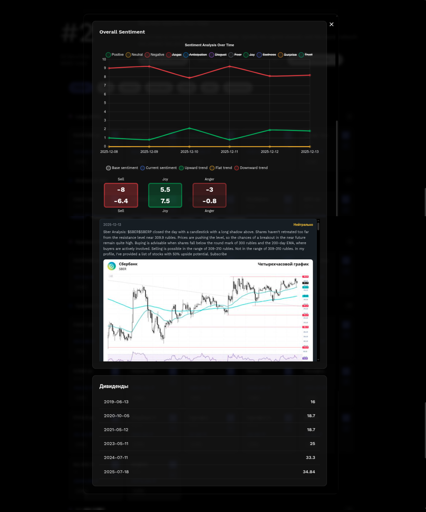

[](https://github.com/wladradchenko/invest.wladradchenko.ru/blob/main/LICENSE)
[](https://badge.fury.io/py/aiohttp)
[](https://github.com/wladradchenko/invest.wladradchenko.ru)
[](https://github.com/wladradchenko/invest.wladradchenko.ru/blob/main/LICENSE)

<div id="top"></div>

<br />
<div align="center">
  <a href="https://github.com/wladradchenko/invest.wladradchenko.ru">
    
  </a>

  <h3 align="center">MOEX Portfolio Calculator</h3>

  <p align="center">
    Документация
    <br/>
    <br/>
    <a href="https://github.com/wladradchenko/invest.wladradchenko.ru/issues">Issues</a>
    ·
    <a href="https://github.com/wladradchenko/invest.wladradchenko.ru/issues">Discussions</a>
  </p>
</div>

Современное веб-приложение для анализа акций Московской Биржи (MOEX) с использованием нейронных сетей и технических индикаторов.

## Возможности

* **Технические индикаторы с подробными объяснениями и рекомендациями**

  * RSI (Индекс относительной силы)
  * MACD (Схождение/расхождение скользящих средних)
  * Полосы Боллинджера
  * EMA (Экспоненциальная скользящая средняя)
  * ADX (Средний индекс направленного движения)
  * Общая оценка и рекомендации

* **Нейронные сети для анализа настроения рынка по ценной бумаге**
  * LLM модель для анализа текста, картинки, видео и фильтрации комментариев
  * Анализатор настроений из текста
  * Анализатор эмоций из текста
  * Парсинг комментариев за 7 дней по ценной бумаге
  * Рассчет индикаторов настроения

* **Нейронные сети для прогнозирования цен**

  * LSTM модели для анализа временных рядов
  * Прогноз на 7 дней вперед
  * Оценка уверенности модели

* **Умные рекомендации**

  * Автоматический анализ всех индикаторов
  * Комбинирование индикаторов и акций
  * Рекомендации по покупке/продаже/держанию
  * Объяснение каждого показателя

* **Пользовательский интерфейс**

  * Новый дизайн
  * Светлая цветовая схема
  * Адаптивная верстка

* **SQLite база данных**

  * Легковесная локальная БД
  * Кэширование данных
  * Быстрый доступ к историческим данным

## Установка

1. Убедитесь, что установлен Python 3.9+.
2. Создайте виртуальное окружение (если не создано):

```bash
python -m venv venv
source venv/bin/activate  # Linux/Mac
# или
venv\Scripts\activate  # Windows
```

3. Установите зависимости:

```bash
pip install -r requirements.txt
```

**Примечание**: TA-Lib может потребовать установки системных библиотек:

* Ubuntu/Debian: `sudo apt-get install ta-lib`
* macOS: `brew install ta-lib`
* Windows: скачайте библиотеку с [официального сайта](https://ta-lib.org/install/)

Приложение будет работать с упрощенными индикаторами, если TA-Lib недоступна.

## Зависимости

* `aiohttp` — асинхронный веб-фреймворк
* `aiosqlite` — асинхронный клиент SQLite
* `numpy`, `pandas` — обработка данных
* `scikit-learn` — машинное обучение
* `torch` — PyTorch для нейронных сетей
* `TA-Lib` — технические индикаторы (опционально)

## Запуск приложения

```bash
python app.py
```

Приложение будет доступно по адресу: [http://localhost:8080](http://localhost:8080)

## Использование

1. Откройте приложение в браузере.
2. Выберите один или несколько индексов.
3. Выберите акции, при необходимости скорректируйте веса и нажмите «Рассчитать портфель».
4. Просмотрите результаты анализа:

   * Технические индикаторы с объяснениями
   * Рекомендации по покупке/продаже
   * Прогнозы нейронной сети
   * Общая оценка акций

Дополнительно:

* Технические индикаторы, прогноз изменения цены, купоны, дивиденды в подробном описании акции
* Группировка акций по индикаторам и общим заключениям
* Комбинирование различных индикаторов и интеллектуальное исключение недовзвешенных акций с перерасчетом веса с учетом диверсификации

## Архитектура

Проект состоит из следующих модулей:

* `app.py` — основное приложение и веб-сервер
* `database.py` — управление SQLite базой данных
* `moex_api.py` — клиент MOEX API
* `ml_models.py` — модели машинного обучения (LSTM)
* `text_models.py` — модели для анализа текста (LLM)
* `indicators.py` — расчёт технических индикаторов
* `static/` — статические файлы (HTML, CSS, JS)

## API Endpoints

* `GET /` — главная страница
* `GET /api/security/{secid}` — данные по акции
* `GET /api/security/{secid}/dividends` — данные о дивидендах
* `GET /api/security/{secid}/coupons` — данные о купонах
* `GET /api/security/{secid}/yields` — данные о доходности
* `GET /api/security/{secid}/specification` — данные спецификации
* `GET /api/security/{secid}/history/sessions` — данные о сессиях для хранения в кэше
* `GET /api/security/{secid}/reviews/meta` — данные о последнем обновлении обзора
* `GET /api/security/{secid}/reviews/progress` — ход сбора и обработки обзоров
* `GET /api/security/{secid}/reviews/start` — начало сбора и обработки обзоров
* `GET /api/search?q={query}` — поиск акций
* `GET /api/news` — список новостей
* `GET /api/indexes` — список индексов
* `GET /api/index/{indexid}/securities` — акции, входящие в индекс
* `GET /api/portfolio/calculate` — рассчитать портфель с новыми ценными бумагами

## Примеры индексов

* MOEX10 — индекс MOEX
* MOEXBC — индекс «голубые фишки»
* MOEXBMI — широкий рынок
* RGBI — государственные облигации (RGBI)
* RUABITR — ABI TR

## Важные замечания

1. Прогнозы **не являются финансовой рекомендацией**; используйте их только для анализа.
2. Для качественных прогнозов нейронным сетям требуется минимум 60 свечей исторических данных.
3. MOEX API имеет ограничения по количеству запросов; избегайте чрезмерной нагрузки.
4. TA-Lib опциональна; приложение работает с упрощенными индикаторами при её отсутствии.

## Отличия от предыдущей версии

* Убрана зависимость от Tinkoff API
* Используется только MOEX API
* Переход на SQLite вместо MySQL
* Добавлены нейронные сети для прогнозов
* Улучшенный дизайн интерфейса
* Подробные объяснения технических индикаторов
* Умная система рекомендаций

## Лицензия

Проект является персональным pet-проектом для обучения и анализа.

## Вклад

Проект открыт для улучшений и предложений.

<!-- VIDEO -->
## Скриншоты

| Начальная | Индексы | Ценные бумаги |
|--------------|--------------|--------------|
| [](screens/1.png) | [](screens/2.png) | [](screens/3.png) |

| Технические индикаторы и прогнозируемая цена | Анализ настроения | Результаты портфеля |
|--------------|--------------|--------------|
| [](screens/4.png) | [](screens/6.png) | [](screens/5.png) |

<!-- CONTACT -->

## Контакты

Автор: [Владислав Радченко](https://github.com/wladradchenko/)

Email: [i@wladradchenko.ru](mailto:i@wladradchenko.ru)

Поддержка: [Patreon](https://www.patreon.com/c/wladradchenko)

Проект: [https://github.com/wladradchenko/invest.wladradchenko.ru](https://github.com/wladradchenko/invest.wladradchenko.ru)

<p align="right">(<a href="#top">вернуться наверх</a>)</p> 

